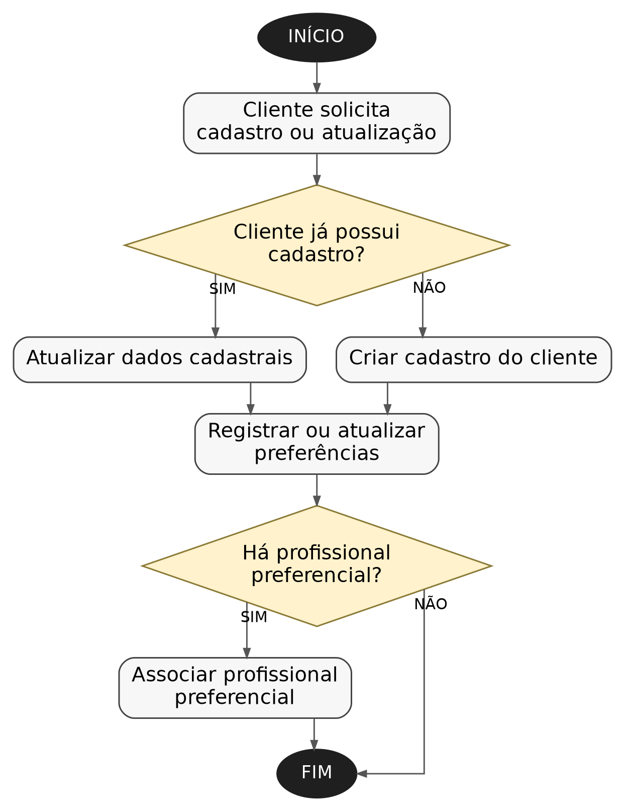
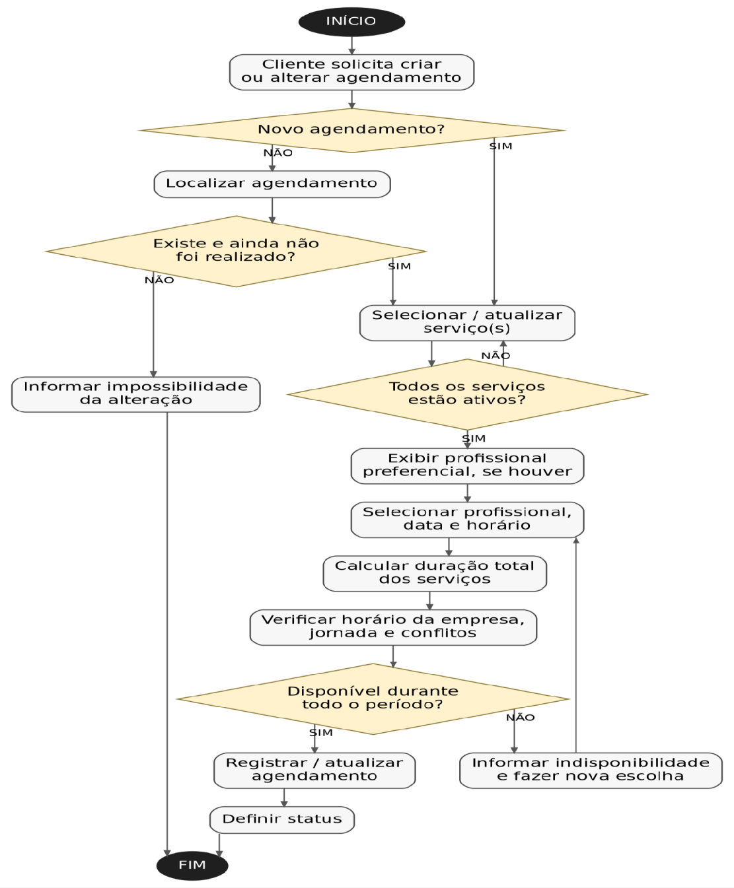
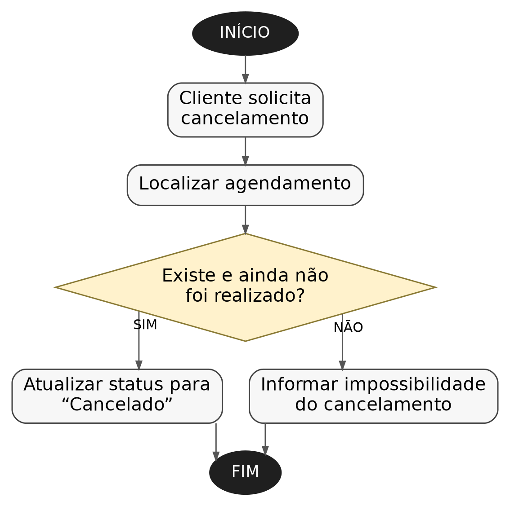
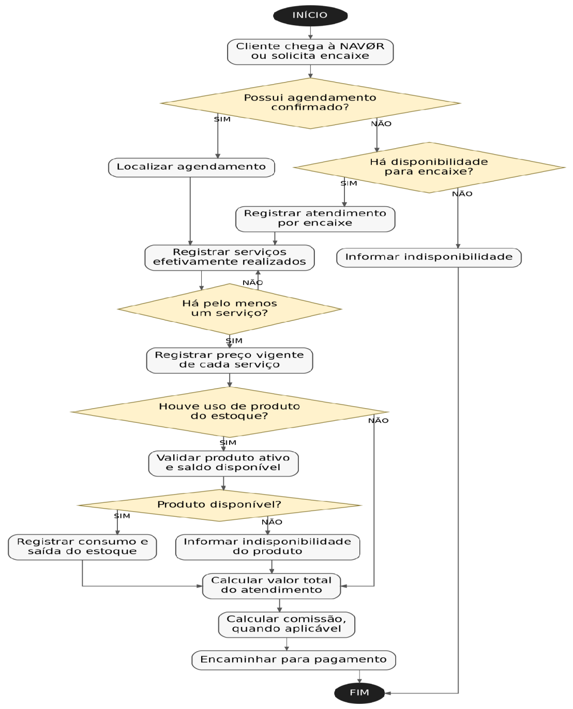
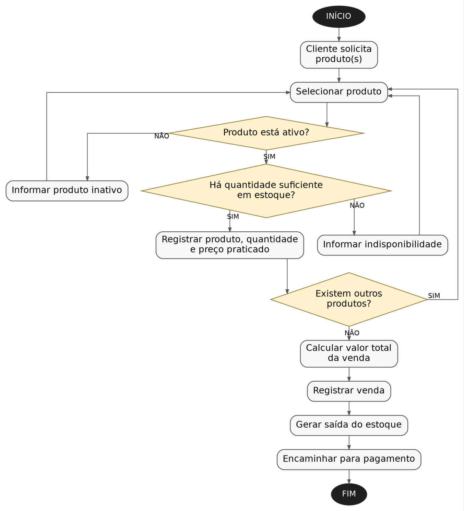
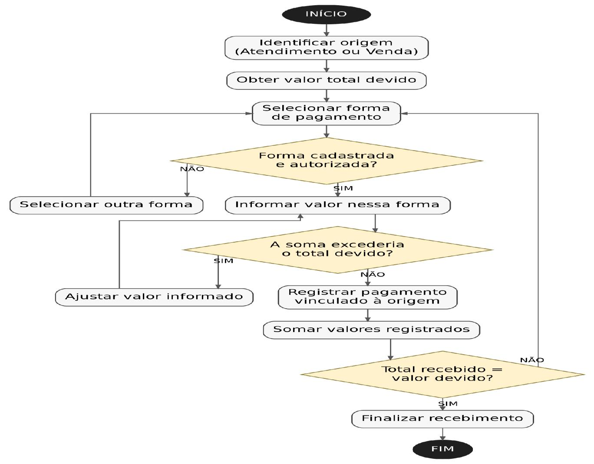
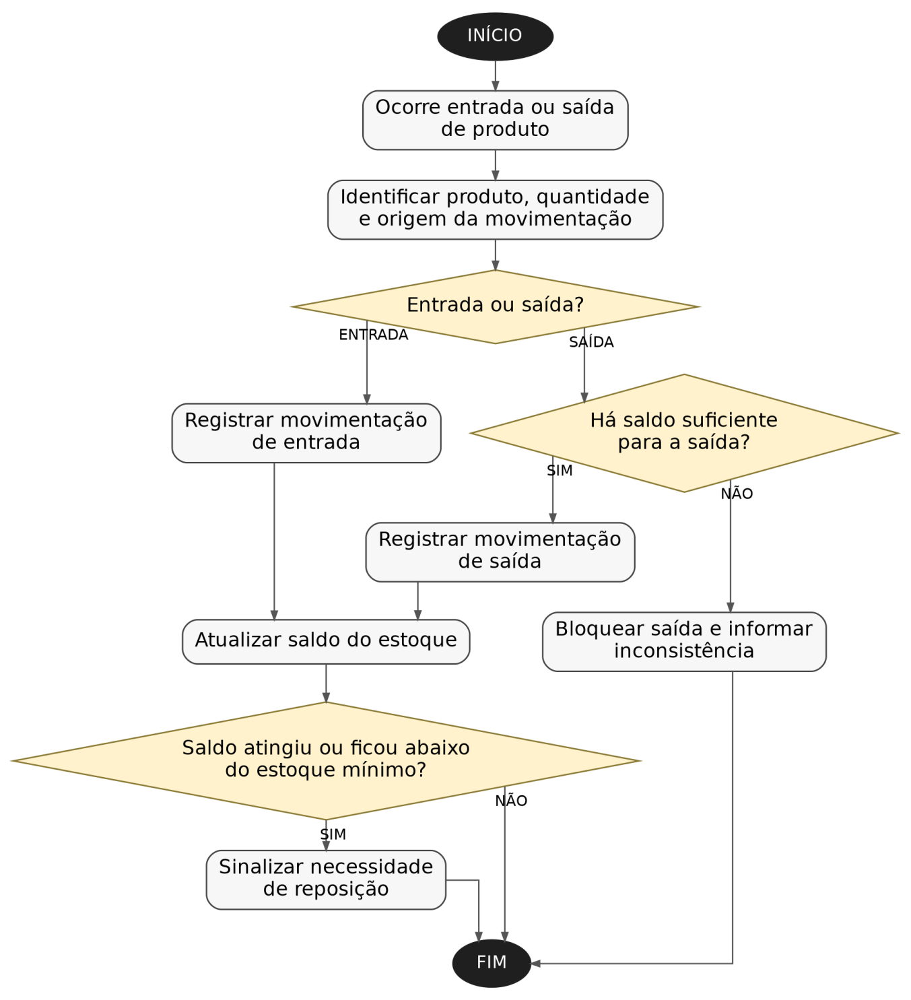
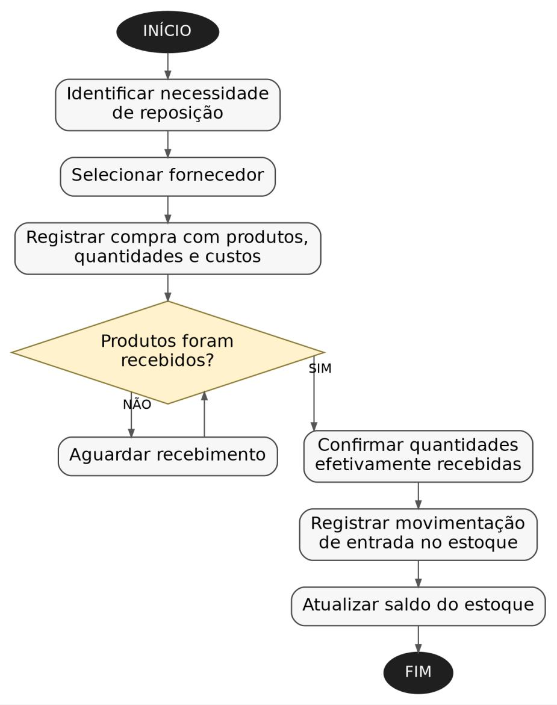
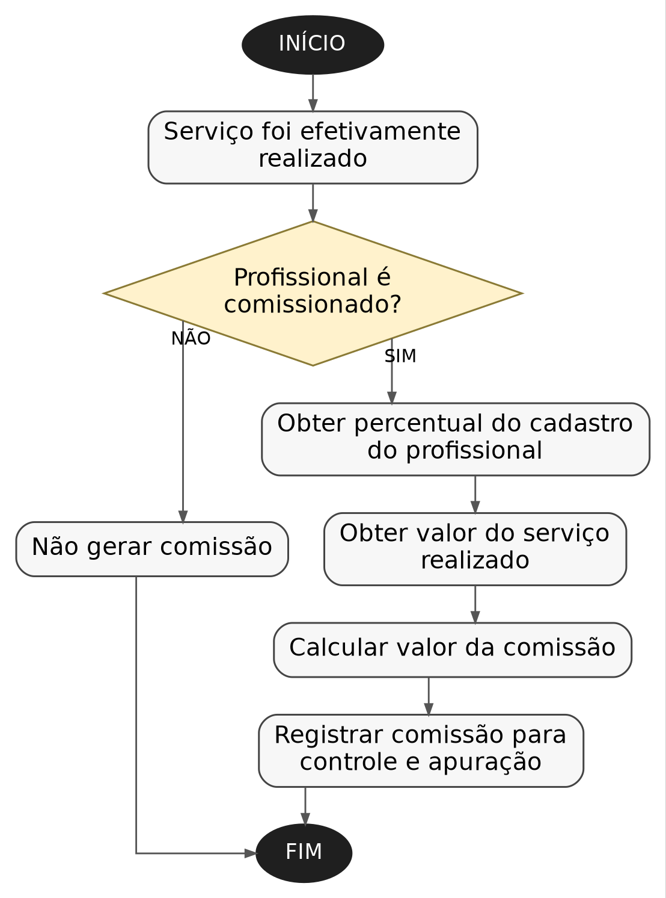
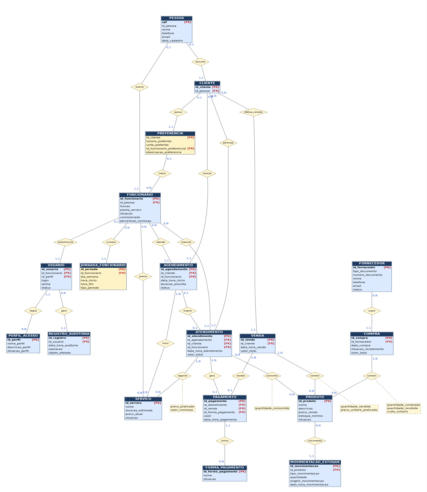

## 1. Identificação da equipe

**RGM's Clóvis:**

- Kauan Ribeiro Perez de Toledo  
  RGM: 04932791-7
- Oséias Silva Barbosa  
  RGM: 04934913-9
- Guilherme Elder da Silva  
  RGM: 04880198-4
- Matheus Ferreira Nunes  
  RGM: 04879632-8
- Guilherme Carlos da Silva  
  RGM: 04947745-5
- Mariana Morato Santos  
  RGM: 04916587-9
- Pamela de Moraes Ezequiel  
  RGM: 04930256-6
- Daniel Pedro Alves de Almeida Nunes  
  RGM: 04879452-0
- Erisclécio Araujo dos Santos  
  RGM: 04884322-9
- Enzo Camargo  
  RGM: 05006394-4
- Gabriel Rodrigues Queiroz  
  RGM: 05011595-2

**Razão Social:** NAVØR Barbearia Ltda.  
**Nome Fantasia:** NAVØR Barbearia  
**CNPJ:** WR.JV6.ZTE/0001-02 ***(Inscrição fictícia gerada pelo Simulador Nacional de CNPJ da Receita Federal, utilizada exclusivamente para fins acadêmicos e de desenvolvimento do sistema.)***  
**Porte:** Microempresa (ME)  
**Localização:** Rua Caquito, 347 - Penha – São Paulo/SP  
**Ramo de atividade:** Serviços de barbearia, cuidados pessoais e estética masculina  
**Quadro de Funcionários:** 1 proprietário/barbeiro, 2 barbeiros, 1 recepcionista, 1 esteticista e 1 auxiliar de serviços gerais.  
Total: 6 funcionários.  
**Horário de funcionamento:** Terça a sexta, das 9h às 20h; sábado das 9h às 18h; a empresa permanece fechada aos domingos e às segundas-feiras.

| Nome | Significado | Sensação da Marca |
|---|---|---|
| **NAVØR** | Nome criado a partir da sonoridade de *navalha* + ideia de valor. O “Ø” dá identidade visual. | Moderna, premium, urbana |

## 2. Caracterização da empresa

- **Qual é o nome da empresa?** NAVØR Barbearia Ltda.
- **Qual é o segmento?** A NAVØR Barbearia é uma microempresa do segmento de beleza, estética e cuidados pessoais, especializada em serviços voltados predominantemente ao público masculino.
- **O que ela vende ou oferece?** Oferece serviços de barbearia e cuidados pessoais, tratamentos capilares, design de sobrancelhas e procedimentos básicos de estética, como limpeza e hidratação facial. Também comercializa produtos para cabelo e barba, como pomadas, shampoos e óleos, além de bebidas e petiscos no estabelecimento.
- **Quem são seus principais clientes?** Público masculino de diferentes faixas etárias.
- **Quais são seus principais setores?** Recepção, Salão, Estoque, Compras, Financeiro. Por se tratar de uma microempresa, algumas dessas atividades são realizadas ou supervisionadas pelas mesmas pessoas, especialmente pelo proprietário.
- **Como funciona atualmente?**  
Atualmente, a administração da empresa funciona quase 100% de forma manual. Os agendamentos são feitos presencialmente, por telefone ou WhatsApp e registrados em cadernos ou planilhas. Além dos atendimentos previamente agendados, a barbearia pode realizar encaixes quando há disponibilidade de horário e de profissional. Os cadastros e o histórico dos clientes não são documentados de forma centralizada, então informações como preferências, serviços anteriores e profissional de preferência dependem da memória dos funcionários ou de históricos de mensagens.

  Durante o atendimento, podem ser realizados um ou mais serviços, que também podem utilizar produtos do estoque. Após a realização dos serviços, é necessário registrar os valores correspondentes e calcular as comissões dos profissionais.

  O percentual de comissão adotado pela NAVØR é de 40% sobre os serviços realizados.

  A empresa também comercializa produtos independentemente da prestação de serviços.

  O financeiro é acompanhado por registros manuais e planilhas simples. O estoque é conferido manualmente e a reposição é feita quando os funcionários percebem que determinado produto está acabando. As compras são realizadas conforme a necessidade, sem um cadastro centralizado de fornecedores.

  Com isso, o proprietário tem dificuldade para acompanhar informações como faturamento, serviços mais realizados, frequência dos clientes, desempenho dos profissionais, comissões e movimentação do estoque.
- **Quais informações são importantes para o negócio?** As informações mais importantes da empresa são os dados dos clientes, dados dos funcionários, serviços oferecidos, agendamentos e encaixes, atendimentos realizados, produtos utilizados na prestação de serviços e os produtos comercializados, estoque, fornecedores, vendas, pagamentos, comissões e informações para fidelização de clientes.

  Também são importantes os registros de horários, valores praticados, formas de pagamento, movimentações de estoque e histórico de atendimentos dos clientes, pois essas informações permitem acompanhar a operação e apoiar o controle financeiro e administrativo da empresa.

## 3. Justificativa da escolha do negócio

Escolhemos uma barbearia porque apesar de ser uma pequena empresa, ela possui diferentes processos que precisam estar integrados, como cadastro de clientes, agendamentos, atendimentos, serviços, funcionários, vendas, estoque, compras, fornecedores, pagamentos, comissões e controle financeiro. Um atendimento realizado, por exemplo, pode envolver um cliente, um profissional e vários tipos de serviços, além de gerar um pagamento, comissão para o profissional e movimentação de produtos no estoque, e atualmente essas informações não estão centralizadas. Isso nos permite desenvolver uma modelagem de dados completa e propor um ERP que centralize e relacione essas informações, reduza controles manuais e facilite tanto a operação quanto a gestão do negócio.

## 4. Principais processos de negócio

Os principais processos identificados são:

### 1) Cadastro e relacionamento com clientes

**Quem participa:** Cliente e recepcionista.  
**O que inicia:** Primeiro contato do cliente com a barbearia ou necessidade de atualização cadastral.  
**O que acontece:** São cadastrados os dados de identificação e contato do cliente, além de informações úteis para personalização do atendimento, como preferências e profissional de preferência. Nos atendimentos seguintes, seu histórico poderá ser consultado.  
**Informações geradas:** Dados do cliente, contato, preferências.  
**Resultado:** dados do cliente registrados para utilização nos atendimentos, ainda que atualmente estejam distribuídos entre diferentes meios de controle.

### 2) Agendamento de serviços

**Quem participa:** Cliente, recepcionista e profissional.  
**O que inicia:** Solicitação de um atendimento pelo cliente.  
**O que acontece:** O cliente informa os serviços desejados, data e preferência de profissional. A disponibilidade é verificada e, havendo horário disponível, o agendamento é registrado. Também podem ocorrer posteriormente alteração ou cancelamento.  
**Informações geradas:** Cliente, profissional, serviço(s) solicitado(s), data, horário e status do agendamento.  
**Resultado:** Horário reservado na agenda do profissional.

### 3) Realização do atendimento

**Quem participa:** Cliente, barbeiro ou esteticista e, quando necessário, recepcionista.  
**O que inicia:** Chegada do cliente para um agendamento confirmado ou solicitação de atendimento por encaixe.  
**O que acontece:** O profissional realiza os serviços. Os serviços efetivamente realizados são registrados, podendo ser diferentes dos inicialmente agendados caso o cliente solicite alterações ou serviços adicionais.  
**Informações geradas:** Cliente, profissional responsável, serviços realizados, produtos consumidos e valores praticados.  
**Resultado:** Atendimento realizado e registrado no histórico do cliente.

### 4) Venda de produtos

**Quem participa:** Cliente e recepcionista/atendente.  
**O que inicia:** Interesse do cliente na compra de algum produto comercializado pela NAVØR.  
**O que acontece:** O produto e a quantidade são registrados, o valor é calculado e a venda é realizada. A venda pode acontecer junto a uma visita à barbearia ou independentemente de um atendimento.  
**Informações geradas:** Produto, quantidade, preço praticado, data e valor da venda.  
**Resultado:** Venda concluída e baixa do produto realizada manualmente no controle de estoque.

### 5) Pagamento e controle financeiro

**Quem participa:** Cliente e recepcionista/atendente.  
**O que inicia:** Finalização de um atendimento ou de uma venda.  
**O que acontece:** O valor devido é calculado após o atendimento ou a venda, podendo ser registrado em uma ou mais forma de pagamento. Quando há a divisão de pagamentos, a soma de valores deverá corresponder ao valor total devido.  
**Informações geradas:** Valor, data, forma (s) de pagamentos e origem do recebimento.  
**Resultado:** Pagamento registrado para controle financeiro.

### 6) Controle de estoque e compras

**Quem participa:** Administrador/proprietário e fornecedor.  
**O que inicia:** Entrada, venda, consumo, perda de produto ou identificação da necessidade de reposição.  
**O que acontece:** O estoque é conferido manualmente e sofre alterações em razão de compras, vendas, consumo de produtos nos atendimentos, perdas ou ajustes. Quando é identificada a necessidade de reposição, o responsável realiza uma compra junto ao fornecedor e, após o recebimento, os produtos são adicionados ao estoque.  
**Informações geradas:** Produto, quantidade, movimentação, data, fornecedor, compra realizada e custo.  
**Resultado:** Estoque atualizado e disponibilidade de produtos para utilização ou venda.

### 7) Controle de comissão dos profissionais

**Quem participa:** Profissional e administrador/proprietário.  
**O que inicia:** Conclusão de um serviço realizado por um profissional.  
**O que acontece:** É calculada a comissão correspondente a 40% do valor do serviço realizado.  
**Informações geradas:** Profissional, serviço realizado, valor do serviço e valor da comissão.  
**Resultado:** Comissão registrada para controle e apuração.

## 5. Problemas e necessidades identificados

**a. Onde existe retrabalho?**  
Existe retrabalho principalmente no agendamento, controle financeiro, estoque e cadastro de clientes, pois as informações são registradas e consultadas manualmente em diferentes meios, como cadernos, planilhas e mensagens de WhatsApp. Em algumas situações, uma mesma informação precisa ser conferida ou registrada novamente para realizar o fechamento do caixa, calcular comissões ou verificar a disponibilidade dos profissionais.  
**Necessidade:** centralizar as informações utilizadas nos principais processos, reduzindo registros repetidos e facilitando consultas e conferências.

**b. Existem informações duplicadas?**  
Há risco de duplicidade de informações, principalmente no cadastro de clientes e nos registros de agendamentos. Um mesmo cliente pode, por exemplo, ter seus dados registrados em uma planilha e também aparecer em conversas ou anotações utilizadas pela recepção.  
**Necessidade:** manter um cadastro único e centralizado para clientes, funcionários, produtos, serviços e demais informações utilizadas pela empresa.

**c. Existem informações perdidas?**  
Sim. Informações sobre preferências dos clientes, serviços realizados anteriormente, profissional de preferência, alterações de agendamento e consumo de produtos podem não ser registradas adequadamente ou permanecer apenas em mensagens e na memória dos funcionários.  
Isso dificulta a recuperação dessas informações posteriormente.  
**Necessidade:** manter os dados e históricos registrados no sistema para facilitar consultas futuras.

**d. A empresa utiliza planilhas?**  
Sim. A NAVØR utiliza planilhas simples como apoio para alguns controles administrativos, principalmente relacionados ao caixa, registros financeiros e acompanhamento da operação.  
**Necessidade:** substituir gradualmente as planilhas utilizadas como controles operacionais pelo ERP, mantendo a possibilidade de exportar relatórios para planilhas quando necessário.

**e. Existem controles manuais?**  
Sim. Atualmente grande parte da administração é manual. Entre os principais controles estão agendamentos, conferência de horários, estoque, caixa, compras e cálculo das comissões dos profissionais.  
As comissões também são calculadas e conferidas manualmente por meio de planilhas.  
**Necessidade:** automatizar os principais controles e relacionar as informações geradas durante a operação.

**f. Os setores compartilham informações?**  
O compartilhamento ocorre de maneira informal e sem integração automática. Como a NAVØR é uma microempresa, não existem grandes departamentos independentes, porém recepção, profissionais, administração, estoque e financeiro precisam utilizar informações em comum.  
Por exemplo, a recepção registra um atendimento, o profissional executa os serviços, o financeiro precisa saber o valor recebido e a comissão, enquanto o estoque precisa registrar eventuais produtos consumidos ou vendidos.  
**Necessidade:** fazer com que todas as áreas tenham acesso às mesmas informações de forma atualizada.

**g. É difícil encontrar informações?**  
Sim. Como os dados estão distribuídos entre cadernos, planilhas, WhatsApp e conhecimento dos próprios funcionários, algumas consultas podem exigir a busca em diferentes locais.  
Por exemplo, pode ser difícil consultar rapidamente todos os serviços realizados anteriormente por determinado cliente ou identificar seu profissional de preferência.  
**Necessidade:** centralizar as informações e permitir a consulta ao histórico de atendimentos, serviços realizados e demais registros dos clientes.

**h. Existem erros de cadastro?**  
Não foi identificado no levantamento realizado que a NAVØR possua erros frequentes de cadastro. Mas, como os registros são manuais, existe risco de dados incompletos, desatualizados ou duplicados.  
**Necessidade:** padronizar os cadastros e manter as informações sempre atualizadas.

**i. É difícil acompanhar estoque, vendas, clientes ou profissionais?**  
Sim. O acompanhamento dessas informações é prejudicado pela ausência de integração.  
No estoque, é difícil conhecer com precisão entradas, saídas, consumo e necessidade de reposição.  
Nas vendas, é necessário relacionar produtos vendidos, valores recebidos e baixa no estoque.  
Nos clientes, falta um histórico centralizado de atendimentos e preferências.  
Nos profissionais, existe dificuldade para acompanhar agenda, serviços realizados e respectivas comissões.  
**Necessidade:** integrar essas informações no ERP, permitindo acompanhamento atualizado da operação.

**j. Existem problemas para gerar relatórios?**  
Sim. Como as informações estão distribuídas e parte dos registros é manual, a administração precisa reunir e conferir dados de diferentes fontes para analisar o desempenho da empresa.  
Isso dificulta obter rapidamente informações como faturamento do período, quantidade de atendimentos, serviços mais realizados, movimentação do estoque e comissões dos profissionais.  
**Necessidade:** permitir a geração automática de relatórios gerenciais.

| Problema | Consequência |
|---|---|
| Agendamentos registrados manualmente e em diferentes canais | Risco de conflito de horários, esquecimentos e dificuldade para consultar a agenda |
| Cadastro de clientes descentralizado | Risco de informações duplicadas, incompletas ou desatualizadas |
| Histórico dos clientes não centralizado | Dificuldade para consultar serviços anteriores, preferências e profissional de preferência |
| Informações distribuídas entre cadernos, planilhas e WhatsApp | Dificuldade para localizar informações e necessidade de retrabalho |
| Controle manual de estoque | Divergências na quantidade disponível e dificuldade para identificar a necessidade de reposição |
| Venda de produtos não integrados ao estoque | Estoque desatualizado e necessidade de realizar baixas manualmente |
| Compras e fornecedores sem controle integrado | Dificuldade para acompanhar reposições, produtos adquiridos e custos |
| Controle financeiro realizado em planilhas | Dificuldade para acompanhar recebimentos, faturamento e resultados da empresa |
| Pagamentos não integrados aos atendimentos e vendas | Maior dificuldade para conferir os valores recebidos e identificar sua origem |
| Cálculo manual das comissões | Risco de erros nos valores e maior tempo gasto na conferência |
| Informações dos funcionários controladas separadamente | Dificuldade para acompanhar agenda, atendimentos realizados e comissões |
| Falta de integração entre as áreas da empresa | A mesma informação precisa ser consultada ou registrada em diferentes locais |
| Falta de relatórios gerenciais automáticos | Dificuldade para acompanhar faturamento, atendimentos, estoque e desempenho dos profissionais |

## 6. Etapa 5 — Requisitos funcionais

| Código | Nome | Descrição | Objetivo | Responsáveis |
|---|---|---|---|---|
| RF01 | Cadastro de clientes | O sistema deverá permitir o cadastro completo de clientes, exigindo CPF válido e impedindo o cadastro de um CPF já existente. | Manter uma base de clientes atualizada para uso no agendamento, no histórico e em ações de relacionamento. | Recepcionista; Cliente |
| RF02 | Cadastro de fornecedores. | O sistema deverá permitir o cadastro dos fornecedores da empresa. | Manter a base de fornecedores atualizada para futuras compras | Administrador |
| RF03 | Registro de compras. | O sistema deverá permitir o registro das compras realizadas junto aos fornecedores. | Controlar as compras feitas com cada fornecedor, registrando os produtos, as quantidades e os valores para acompanhar a reposição do estoque. | Administrador |
| RF04 | Entrada de produtos por compra | O sistema deverá atualizar o estoque após o recebimento dos produtos comprados. | Manter o estoque atualizado com as quantidades realmente recebidas, evitando que produtos comprados, mas ainda não entregues, apareçam como disponíveis. | Administrador |
| RF05 | Atualização de dados do cliente | O sistema deverá permitir a atualização dos dados cadastrais de um cliente já existente, preservando o histórico de atendimentos anteriores. | Garantir que informações desatualizadas não prejudiquem o contato ou o atendimento. | Recepcionista |
| RF06 | Cadastro de funcionários | O sistema deverá permitir o cadastro dos funcionários, contendo dados pessoais, função, situação e indicação se o funcionário é comissionado. Para funcionários que atuam na prestação de serviços, também poderão ser registradas o percentual de comissão aplicável. | Manter a base de funcionários da empresa e identificar aqueles que atuam como profissionais prestadores de serviços. | Administrador |
| RF07 | Definição da agenda individual do profissional | O sistema deverá permitir o cadastro dos dias e horários de trabalho de cada profissional incluindo intervalos de almoço e folgas. | Possibilitar o cálculo correto da disponibilidade de cada profissional. | Administrador; Profissional |
| RF08 | Cadastro de serviços | O sistema deverá permitir o cadastro de serviços oferecidos, com nome, duração estimada, preço, situação (ativo/inativo). | Padronizar a oferta de serviços utilizada no agendamento e na composição do valor do atendimento. | Administrador |
| RF09 | Cadastro de produtos | O sistema deverá permitir o cadastro de produtos utilizados internamente ou vendidos ao cliente, com preço de venda e estoque mínimo. | Controlar os itens que compõem o estoque da barbearia. | Administrador |
| RF10 | Cadastro de formas de pagamento | O sistema deverá permitir o cadastro das formas de pagamento aceitas pela barbearia (dinheiro, cartão de débito, cartão de crédito, PIX). | Padronizar o registro financeiro dos atendimentos e vendas. | Administrador |
| RF11 | Criação de agendamento | O sistema deverá permitir que o cliente ou a recepção criem um agendamento, informando um ou mais serviços, o profissional desejado e a data/horário pretendidos. | Organizar a fila de atendimento e reduzir agendamentos feitos de forma manual. | Cliente; Recepcionista |
| RF12 | Verificação de disponibilidade do profissional | O sistema deverá verificar, no momento da criação do agendamento, se o profissional selecionado está disponível no intervalo total de tempo necessário para os serviços selecionados. | Evitar a oferta de horários que já estejam ocupados. | Recepcionista; Sistema |
| RF13 | Prevenção de conflito de horários | O sistema deverá impedir a existência de dois agendamentos confirmados sobrepostos para o mesmo profissional. | Garantir a integridade da agenda de cada profissional. | Sistema |
| RF14 | Sugestão de profissional preferencial | O sistema deverá exibir, durante o agendamento, o profissional preferencial do cliente como opção destacada, sem impedir a escolha de outro profissional. | Agilizar o processo de agendamento para clientes recorrentes. | Cliente; Recepcionista |
| RF15 | Alteração de agendamento | O sistema deverá permitir a alteração de data, horário, profissional ou serviços de um agendamento ainda não realizado. | Adaptar a agenda a mudanças solicitadas pelo cliente. | Recepcionista; Cliente |
| RF16 | Cancelamento de agendamento | O sistema deverá permitir o cancelamento de um agendamento, atualizando a situação para cancelado. | Manter a agenda e o histórico de agendamentos atualizados. | Recepcionista; Cliente |
| RF17 | Registro de atendimento | O sistema deverá registrar o atendimento realizado, podendo estar relacionado a um agendamento ou ocorrer por encaixe. | Registrar tanto atendimentos agendados quanto encaixes. | Recepcionista; Profissional |
| RF18 | Registro dos serviços executados | O sistema deverá permitir o registro dos serviços efetivamente realizados em um atendimento, mesmo que divirjam do que foi originalmente agendado. | Refletir com precisão o que foi realizado, incluindo serviços adicionais solicitados no local. | Profissional |
| RF19 | Registro de venda avulsa de produtos | O sistema deverá permitir o registro da venda de produtos ao cliente sem vínculo obrigatório com um atendimento. | Permitir que a barbearia comercialize produtos de forma independente do serviço prestado. | Recepcionista |
| RF20 | Cálculo do atendimento | O sistema deverá calcular o valor do atendimento com base nos serviços efetivamente realizados. | Eliminar cálculos manuais sujeitos a erro no fechamento do atendimento. | Sistema |
| RF21 | Registro de pagamento | O sistema deverá permitir o registro de um ou mais pagamentos vinculados a um atendimento ou a uma venda, identificando valor, data, forma de pagamento e origem de cada recebimento | Relacionar os valores recebidos às operações que os originaram. | Recepcionista |
| RF22 | Controle de estoque | O sistema deverá registrar toda entrada e saída de produtos do estoque, associando cada movimentação a uma origem (compra, venda, consumo em atendimento, perda/ajuste). | Manter o saldo de estoque confiável e rastreável. | Administrador; Sistema |
| RF23 | Alerta de estoque mínimo | O sistema deverá emitir um alerta quando a quantidade de um produto atingir ou ficar abaixo do estoque mínimo configurado. | Antecipar a reposição e evitar a falta de produtos utilizados nos atendimentos. | Sistema; Administrador |
| RF24 | Cálculo de comissão | O sistema deverá calcular e registrar automaticamente a comissão de cada serviço realizado com base no percentual de comissão cadastrado para o profissional responsável. | Automatizar o cálculo das comissões atualmente realizado manualmente. | Sistema; Administrador |
| RF25 | Consulta ao histórico do cliente | O sistema deverá permitir a consulta do histórico de atendimentos, serviços realizados e produtos consumidos de um cliente específico. | Apoiar o profissional e a recepção no atendimento personalizado do cliente recorrente. | Profissional; Recepcionista |
| RF26 | Consulta de horários disponíveis | O sistema deverá permitir que o cliente consulte, por profissional e por serviço, os horários livres nos próximos dias. | Reduzir a dependência de contato telefônico para verificar disponibilidade. | Cliente |
| RF27 | Emissão de relatórios gerenciais | O sistema deverá emitir relatórios de faturamento, comissões, estoque e atendimentos por período, por profissional ou por serviço. | Fornecer suporte à tomada de decisão do administrador. | Administrador |
| RF28 | Controle de usuários e permissões | O sistema deverá permitir o cadastro de usuários do sistema e a definição de perfis de acesso, restringindo funcionalidades conforme o perfil. | Impedir o uso indevido de funcionalidades sensíveis por pessoas sem autorização. | Administrador |
| RF29 | Exportação de relatórios | O sistema deverá permitir exportar relatórios gerenciais para formato de planilha. | Manter a possibilidade de análise externa já identificada no levantamento. | Administrador |

## 7. Etapa 6 — Requisitos não funcionais

| Código | Categoria | Descrição | Justificativa |
|---|---|---|---|
| RNF01 | Segurança | O sistema deverá restringir o acesso às funcionalidades de acordo com o perfil do usuário autenticado. | Evita que atendentes ou profissionais alterem preços de serviços, percentuais de comissão ou dados financeiros sensíveis. |
| RNF02 | Autenticação | O sistema deverá exigir login com senha para acesso interno do ERP, armazenando as senhas de forma criptografada. | Reduz o risco de acesso indevido às informações de clientes e financeiras. |
| RNF03 | Desempenho | O sistema deverá apresentar o resultado da consulta de disponibilidade em tempo adequado para utilização durante o atendimento. | A consulta de disponibilidade é utilizada com alta frequência durante o expediente e não pode gerar filas de espera no balcão. |
| RNF04 | Disponibilidade | O sistema deverá permanecer disponível para consultas e agendamentos online, exceto em períodos de manutenção programada. | Permite que clientes consultem horários e realizem agendamentos também fora do horário de funcionamento da barbearia. |
| RNF05 | Usabilidade | O sistema deverá apresentar uma interface objetiva para o registro de atendimento, executável pelo profissional entre um cliente e outro sem necessidade de treinamento avançado. | A rotina do profissional é corrida entre atendimentos; telas complexas reduziriam a adesão ao sistema. |
| RNF06 | Confiabilidade transacional | Operações que alterem informações relacionadas entre venda, pagamento e estoque deverão ser concluídas integralmente ou revertidas em caso de falha. | Evita que um produto seja debitado do estoque sem o correspondente registro financeiro, ou vice-versa. |
| RNF07 | Integridade histórica dos dados | O sistema deverá preservar, no histórico de atendimentos, o preço do serviço vigente na data em que foi prestado, mesmo após reajustes posteriores. | Sem essa preservação, relatórios financeiros retroativos ficariam incorretos após qualquer reajuste de preço. |
| RNF08 | Backup | O sistema deverá realizar cópia de segurança automática dos dados diariamente, fora do horário de funcionamento. | Reduz o risco de perda de dados de clientes, agendamentos e histórico financeiro. |
| RNF09 | Recuperação de dados | O sistema deverá permitir a restauração dos dados a partir de uma cópia de segurança em caso de falha grave. | Permite retomar a operação e reduz o risco de perda dos registros da barbearia. |
| RNF10 | Compatibilidade de acesso | O sistema deverá ser acessível a partir de navegadores em computador e em dispositivos móveis, sem exigir instalação de aplicativo específico para o cliente. | Facilita o autoagendamento pelo cliente a partir do próprio celular. |
| RNF11 | Auditoria | O sistema deverá registrar quem realizou, quando e qual operação foi feita em alterações de preços, cancelamentos, ajustes manuais de estoque, cadastros de fornecedores, compras e confirmações de recebimento. | Permite identificar os responsáveis e investigar divergências nos atendimentos, nas compras e no estoque. |
| RNF12 | Privacidade dos dados pessoais | O sistema deverá tratar os dados pessoais dos clientes conforme a legislação de proteção de dados vigente, restringindo o acesso a informações de contato apenas a usuários autorizados. | Os dados de clientes envolvem informações de contato pessoal que exigem tratamento adequado. |

## 8. Etapa 7 — Regras de negócio

| Código | Regra de negócio | Explicação |
|---|---|---|
| RN01 | Um cliente pode possuir vários agendamentos ao longo do tempo. | Permite manter seu histórico de agendamentos. |
| RN02 | Um profissional não pode ter dois agendamentos confirmados sobrepostos em sua agenda individual. | Garante que a agenda de cada profissional reflita a realidade física de que ele atende uma pessoa por vez. |
| RN03 | Todo agendamento deve estar vinculado a exatamente um cliente e a exatamente um profissional responsável. | Permite identificar o cliente que será atendido, o profissional responsável e controlar corretamente a ocupação da agenda. |
| RN04 | Um agendamento só pode ser criado para serviços com situação "ativo". | Evita que serviços descontinuados continuem sendo ofertados para agendamento. |
| RN05 | Quando houver mais de um serviço no agendamento, sua duração prevista será baseada na soma das durações dos serviços selecionados. | Permite calcular corretamente o horário de término estimado e verificar disponibilidade do profissional para o intervalo total. |
| RN06 | Um atendimento pode estar vinculado a um agendamento confirmado ou ser realizado por encaixe, sem agendamento prévio. | Permite identificar quais atendimentos foram agendados e quais ocorreram por encaixe, mantendo o histórico de ambos. |
| RN07 | Os serviços registrados em um atendimento podem divergir dos serviços originalmente agendados, refletindo ajustes solicitados no momento do atendimento. | Contempla situações reais em que o cliente solicita um serviço adicional ou substitui um serviço previamente marcado. |
| RN08 | O valor cobrado por cada serviço em um atendimento deve corresponder ao preço vigente na data do atendimento, sendo esse valor congelado no histórico mesmo diante de reajustes futuros. | Sem o congelamento do valor, relatórios financeiros de períodos anteriores ficariam incorretos após qualquer reajuste de preço. |
| RN09 | Um atendimento pode registrar o consumo de produtos de uso interno, o que gera automaticamente uma movimentação de saída no estoque. | Garante que o estoque reflita o consumo real ocorrido durante o serviço, e não apenas as vendas ao balcão. |
| RN10 | A venda avulsa de um produto não exige vínculo com um atendimento, mas gera movimentação de estoque da mesma forma que o consumo interno. | Reconhece que a barbearia também comercializa produtos de forma independente do serviço prestado. |
| RN11 | Um produto com situação "inativo" não pode ser vendido nem utilizado em atendimentos. | Evita a movimentação de itens descontinuados ou fora de linha. |
| RN12 | O saldo de estoque de um produto não pode se tornar negativo; uma saída maior que o saldo disponível deve ser bloqueada. | Preserva a consistência entre o estoque físico e o estoque registrado no sistema. |
| RN13 | A entrada dos produtos no estoque somente deve ocorrer após a confirmação das quantidades efetivamente recebidas. | Evita que produtos comprados, mas ainda não recebidos, sejam considerados disponíveis. |
| RN14 | Quando o saldo de um produto atingir ou ficar abaixo do estoque mínimo configurado, o sistema deve sinalizar a necessidade de reposição. | Antecipa a falta de insumos utilizados com frequência nos atendimentos. |
| RN15 | Funcionários classificados como profissionais comissionados recebem comissão conforme o percentual definido em seu cadastro. Funcionários não comissionados não geram comissão. | Permite distinguir os funcionários que atuam diretamente na prestação de serviços, como barbeiros e esteticistas, daqueles que exercem funções administrativas ou de apoio. |
| RN16 | Todo pagamento deve possuir exatamente uma origem identificada, correspondente a um atendimento ou a uma venda. | Permite rastrear a origem de cada recebimento. |
| RN17 | A preferência do cliente por determinado profissional não impede seu atendimento por outro profissional. | Mantém flexibilidade operacional e segunda opção para o cliente. |
| RN18 | Um encaixe só pode ocorrer quando existir disponibilidade na agenda do profissional. | Impede conflito com horários já reservados. |
| RN19 | Um atendimento deve possuir pelo menos um serviço realizado e pode possuir vários serviços. | Permite registrar um ou vários serviços realizados em um mesmo atendimento. |
| RN20 | Uma venda deve possuir pelo menos um produto e pode conter vários produtos. | Permite que uma mesma venda contenha um ou vários produtos. |
| RN21 | Uma compra deve possuir pelo menos um produto e pode conter vários produtos. | Permite que uma mesma compra contenha um ou vários produtos adquiridos do fornecedor correspondente. |
| RN22 | Cada compra deve estar vinculada a um fornecedor, e um fornecedor pode estar relacionado a várias compras ao longo do tempo. | Permite identificar de qual fornecedor cada compra foi realizada e manter seu histórico de compras. |
| RN23 | Uma mesma pessoa pode possuir simultaneamente os papéis de cliente e funcionário no sistema. | Permite representar situações em que um funcionário também utiliza os serviços da empresa como cliente, mantendo as informações específicas de cada papel. |
| RN24 | Um atendimento ou uma venda pode utilizar uma ou mais formas de pagamento, desde que a soma dos valores registrados corresponda ao valor total devido. | Permite dividir um pagamento entre diferentes formas, mantendo a consistência do valor recebido. |

## 9. Etapa 8 — Restrições e políticas organizacionais

| Código | Nome | Descrição | Quem deve respeitar | Consequência |
|---|---|---|---|---|
| RP01 | Horário de funcionamento | Agendamentos e encaixes deverão respeitar o horário de funcionamento da empresa e a disponibilidade cadastrada do profissional. | Cliente; Recepcionista; Sistema | Horários indisponíveis não poderão ser confirmados. |
| RP02 | Formas de pagamento | A empresa aceita somente as formas de pagamento previamente cadastradas e autorizadas pela administração e um mesmo atendimento ou venda poderá utilizar mais de uma forma de pagamento. | Recepcionista; Sistema | Formas não cadastradas não poderão ser utilizadas no registro do pagamento. |
| RP03 | Política de comissão | A comissão é aplicada somente aos funcionários classificados como comissionados. Atualmente, barbeiros e esteticistas recebem 40% sobre o valor dos serviços efetivamente realizados. As demais funções não recebem comissão, salvo quando a administração definir que determinada função será comissionada e estabelecer o percentual aplicável. | Administrador; Sistema | O sistema deverá calcular comissão apenas para os funcionários classificados como comissionados, utilizando o percentual definido no cadastro de funcionários. |
| RP04 | Controle de acesso | Informações e funcionalidades administrativas ou financeiras somente poderão ser acessadas por usuários autorizados. | Todos os usuários | Tentativas de acesso não autorizado deverão ser bloqueadas. |
| RP05 | Compras e recebimento | O registro de compras e a confirmação do recebimento dos produtos deverão ser realizados ou autorizados pelo administrador/proprietário. | Administrador | Entradas de produtos não confirmadas não atualizarão o estoque. |

## ETAPA 9 — FLUXOGRAMAS DOS PRINCIPAIS PROCESSOS

### 9.1 Cadastro e relacionamento com clientes

### 9.1 Cadastro e relacionamento com clientes - Observações de modelagem

**Decisão de modelagem:** O fluxo distingue criação e atualização do cadastro. A atualização não cria um novo cliente e deve preservar o histórico já existente, em coerência com o RF05. A verificação prévia reduz o risco de duplicidade identificado no levantamento.

### 9.1 Agendamento de serviços - Alteração

### 9.2 - Agendamento de serviços - Cancelamento

### 9.2 - Agendamento de serviços — Observações de modelagem

**Decisão de modelagem:** O processo foi representado em dois fluxos para manter a leitura clara: criação/alteração e cancelamento. Juntos, eles contemplam RF11, RF15 e RF16. Na criação ou alteração, todos os serviços precisam estar ativos e a duração prevista considera a soma das durações selecionadas.

**Justificativa técnica:** A disponibilidade é validada para todo o intervalo necessário, considerando horário de funcionamento, jornada do funcionário e conflitos com agendamentos existentes. Isso materializa RN02, RN04, RN05 e RP01.

**Observação:** O profissional preferencial é apenas uma opção destacada, conforme RF14 e RN17; o cliente continua podendo escolher outro profissional.

### 9.3 - Realização do atendimento - Observações de modelagem

**Decisão de modelagem:** Agendamento e Atendimento permanecem separados porque representam fatos diferentes: o primeiro é uma reserva futura; o segundo registra o que efetivamente ocorreu. O atendimento pode vir de agendamento confirmado ou de encaixe, conforme RN06 e RN18.

**Justificativa técnica:** O fluxo registra apenas os serviços efetivamente realizados, mesmo que sejam diferentes dos agendados, atendendo RF18 e RN07. O preço vigente de cada serviço é registrado no atendimento e preservado no histórico, conforme RN08 e RNF07.

**Observação:** O consumo de produtos é opcional. Quando ocorrer, o produto deve estar ativo e possuir saldo suficiente antes da movimentação de saída, em coerência com RN09, RN11 e RN12

### 9.4 - Venda de produtos

### 9.4 - Venda de produtos — Observações de modelagem

**Decisão de modelagem:** Venda permanece independente de Atendimento, porque a NAVØR comercializa produtos mesmo sem prestação de serviço. A venda registra produto, quantidade e preço praticado e somente segue quando existe disponibilidade de estoque.

**Justificativa técnica:** A saída de estoque é consequência da venda e deve permanecer rastreável pelo RF22. O fluxo encaminha a operação ao processo de Pagamento em vez de registrar o pagamento dentro da venda, evitando duplicação de responsabilidades.

### 9.5 Pagamento

### 9.5 - Pagamento - Observações de modelagem

**Decisão de modelagem:** Cada pagamento fica vinculado a exatamente uma origem — Atendimento ou Venda — conforme RN16. Uma mesma origem pode receber um ou mais registros de pagamento, permitindo divisão entre formas diferentes, conforme RF21, RN24 e RP02.

**Justificativa técnica:** O recebimento só é finalizado quando a soma dos valores registrados corresponde ao valor devido. Valores que ultrapassem o total são ajustados antes do registro; valores inferiores exigem nova forma de pagamento.

### 9.6 - Controle de estoque e compras — Movimentação de estoque

### 9.6 - Controle de estoque e compras — Compra e recebimento

### 9.6 - Controle de estoque e compras - Observações de modelagem

**Decisão de modelagem:** O processo foi dividido visualmente em movimentação de estoque e compra/recebimento porque o levantamento descreve as duas responsabilidades. Venda, consumo, perda, ajuste e recebimento geram movimentações com origem identificada; a necessidade de reposição inicia a compra.

**Justificativa técnica:** Uma compra registrada não aumenta o estoque imediatamente. A entrada ocorre apenas após o recebimento e a confirmação das quantidades efetivamente recebidas, conforme RF04, RN13 e RP05. Saídas superiores ao saldo disponível são bloqueadas pela RN12.

**Observação:** Após cada movimentação, o saldo é reavaliado. Quando atingir ou ficar abaixo do estoque mínimo, o sistema sinaliza necessidade de reposição, em coerência com RF23.

### 9.7 - Comissão

### 9.7 Comissões — Observações de modelagem

**Decisão de modelagem:** A comissão só é gerada depois da realização efetiva de um serviço e somente para profissionais classificados como comissionados. O percentual é obtido do cadastro do profissional, em coerência com RF24, RN15 e RP03.

**Justificativa técnica:** O fluxo registra a comissão para controle e apuração, sem incluir seu pagamento ao profissional, porque o documento atual não possui requisito funcional específico para esse pagamento. Assim, o fluxograma não introduz uma funcionalidade não levantada.

## ETAPA 10 – IDENTIFIQUE AS ENTIDADES

| ENTIDADE | TIPO ENTIDADE | JUSTIFICATIVA |
|---|---|---|
| PESSOA | FORTE | Centraliza os dados comuns de uma pessoa, permitindo que ela exerça simultaneamente os papéis de cliente e funcionário. |
| CLIENTE | FORTE | Possui cadastro e participa de agendamentos, atendimentos e vendas, permitindo a manutenção de seu histórico e preferências. |
| FUNCIONARIO | FORTE | Representa o vínculo funcional com a empresa e mantém informações referentes à função, situação e condição de comissionamento, quando aplicável. |
| USUARIO | FORTE | Representa a conta utilizada para acesso ao sistema, permitindo autenticação e aplicação das permissões definidas pelo perfil de acesso associado. |
| PERFIL_ACESSO | FORTE | Representa o conjunto de permissões e restrições utilizados para controlar as funcionalidades que podem ser acessadas pelos usuários. |
| PREFERENCIA | FRACA | Armazena somente preferências de atendimento quando o cliente optar por informá-las; não é criada para clientes que apenas realizam compras e não possuem preferências registradas. Entidade dependente de CLIENTE. |
| SERVICO | FORTE | Possui cadastro, é agendado e efetivamente realizado. |
| PRODUTO | FORTE | Possui cadastro, é vendido, consumido e gera movimentação no estoque. |
| FORNECEDOR | FORTE | Possui cadastro próprio e participa das compras. |
| AGENDAMENTO | FORTE | Representa a reserva futura de um ou mais serviços. |
| ATENDIMENTO | FORTE | Representa aquilo que efetivamente aconteceu. |
| VENDA | FORTE | Representa a comercialização de um ou mais produtos, podendo ocorrer independentemente de um atendimento. |
| COMPRA | FORTE | Registra uma aquisição de produtos junto ao fornecedor. |
| PAGAMENTO | FORTE | Registra o recebimento originado por uma venda ou atendimento. |
| FORMA_PAGAMENTO | FORTE | Possui cadastro próprio e é utilizado nos pagamentos. |
| MOVIMENTACAO_ESTOQUE | FORTE | Entradas e saídas precisam ser registradas e rastreadas. |
| JORNADA_FUNCIONARIO | FRACA | Jornada de trabalho, intervalos e folgas precisam ser registradas. Depende da entidade FUNCIONARIO para existir. |
| REGISTRO_AUDITORIA | FORTE | Guarda usuário, momento e operação realizada (Como solicitado na RNF11) |

## ETAPA 11 – IDENTIFIQUE OS ATRIBUTOS

| ENTIDADE | ATRIBUTO | TIPO ATRIBUTO |
|---|---|---|
| PESSOA | cpf | SIMPLES (PK) |
| PESSOA | id_pessoa | SIMPLES |
| PESSOA | nome | SIMPLES |
| PESSOA | telefone | MULTIVALORADO |
| PESSOA | email | SIMPLES |
| PESSOA | data_cadastro | SIMPLES |
| CLIENTE | id_cliente | SIMPLES (PK) |
| CLIENTE | id_pessoa | SIMPLES (FK) |
| FUNCIONARIO | id_funcionario | SIMPLES (PK) |
| FUNCIONARIO | id_pessoa | SIMPLES (FK) |
| FUNCIONARIO | funcao | SIMPLES |
| FUNCIONARIO | presta_servico | SIMPLES |
| FUNCIONARIO | situacao | SIMPLES |
| FUNCIONARIO | comissionado | SIMPLES |
| FUNCIONARIO | percentual_comissao | SIMPLES |
| PREFERENCIA | id_cliente | SIMPLES (FK) |
| PREFERENCIA | horario_preferido | SIMPLES |
| PREFERENCIA | corte_preferido | SIMPLES |
| PREFERENCIA | id_funcionario_preferencial | SIMPLES (FK) |
| PREFERENCIA | observacao_preferencia | SIMPLES |
| USUARIO | id_usuario | SIMPLES (PK) |
| USUARIO | id_funcionario | SIMPLES (FK) |
| USUARIO | id_perfil | SIMPLES (FK) |
| USUARIO | login | SIMPLES |
| USUARIO | senha | SIMPLES |
| USUARIO | status | SIMPLES |
| PERFIL_ACESSO | id_perfil | SIMPLES (PK) |
| PERFIL_ACESSO | nome_perfil | SIMPLES |
| PERFIL_ACESSO | descricao_perfil | SIMPLES |
| PERFIL_ACESSO | situacao_perfil | SIMPLES |
| SERVICO | id_servico | SIMPLES (PK) |
| SERVICO | nome | SIMPLES |
| SERVICO | duracao_estimada | SIMPLES |
| SERVICO | preco_atual | SIMPLES |
| SERVICO | situacao | SIMPLES |
| PRODUTO | id_produto | SIMPLES (PK) |
| PRODUTO | nome | SIMPLES |
| PRODUTO | descricao | SIMPLES |
| PRODUTO | preco_venda | SIMPLES |
| PRODUTO | estoque_minimo | SIMPLES |
| PRODUTO | situacao | SIMPLES |
| FORNECEDOR | id_fornecedor | SIMPLES (PK) |
| FORNECEDOR | tipo_documento | SIMPLES |
| FORNECEDOR | numero_documento | SIMPLES |
| FORNECEDOR | nome | SIMPLES |
| FORNECEDOR | telefone | MULTIVALORADO |
| FORNECEDOR | email | SIMPLES |
| FORNECEDOR | status | SIMPLES |
| AGENDAMENTO | id_agendamento | SIMPLES (PK) |
| AGENDAMENTO | id_cliente | SIMPLES (FK) |
| AGENDAMENTO | id_funcionario | SIMPLES (FK) |
| AGENDAMENTO | data_hora_inicio | SIMPLES |
| AGENDAMENTO | duracao_prevista | DERIVADO |
| AGENDAMENTO | status | SIMPLES |
| ATENDIMENTO | id_atendimento | SIMPLES (PK) |
| ATENDIMENTO | id_agendamento | SIMPLES (FK) |
| ATENDIMENTO | id_cliente | SIMPLES (FK) |
| ATENDIMENTO | id_funcionario | SIMPLES (FK) |
| ATENDIMENTO | data_hora_atendimento | SIMPLES |
| ATENDIMENTO | valor_total | DERIVADO |
| VENDA | id_venda | SIMPLES (PK) |
| VENDA | id_cliente | SIMPLES (FK) |
| VENDA | data_hora_venda | SIMPLES |
| VENDA | valor_total | DERIVADO |
| COMPRA | id_compra | SIMPLES (PK) |
| COMPRA | id_fornecedor | SIMPLES (FK) |
| COMPRA | data_compra | SIMPLES |
| COMPRA | situacao_recebimento | SIMPLES |
| COMPRA | valor_total | DERIVADO |
| PAGAMENTO | id_pagamento | SIMPLES (PK) |
| PAGAMENTO | id_atendimento | SIMPLES (FK) |
| PAGAMENTO | id_venda | SIMPLES (FK) |
| PAGAMENTO | id_forma_pagamento | SIMPLES (FK) |
| PAGAMENTO | valor | SIMPLES |
| PAGAMENTO | data_hora_pagamento | SIMPLES |
| FORMA_PAGAMENTO | id_forma_pagamento | SIMPLES (PK) |
| FORMA_PAGAMENTO | nome | SIMPLES |
| FORMA_PAGAMENTO | situacao | SIMPLES |
| MOVIMENTACAO_ESTOQUE | id_movimentacao | SIMPLES (PK) |
| MOVIMENTACAO_ESTOQUE | id_produto | SIMPLES (FK) |
| MOVIMENTACAO_ESTOQUE | tipo_movimentacao | SIMPLES |
| MOVIMENTACAO_ESTOQUE | quantidade | SIMPLES |
| MOVIMENTACAO_ESTOQUE | origem_movimentacao | SIMPLES |
| MOVIMENTACAO_ESTOQUE | data_hora_movimentacao | SIMPLES |
| JORNADA_FUNCIONARIO | id_funcionario | SIMPLES (FK) |
| JORNADA_FUNCIONARIO | dia_semana | SIMPLES |
| JORNADA_FUNCIONARIO | hora_inicio | SIMPLES |
| JORNADA_FUNCIONARIO | hora_fim | SIMPLES |
| JORNADA_FUNCIONARIO | tipo_periodo | SIMPLES |
| REGISTRO_AUDITORIA | id_registro | SIMPLES (PK) |
| REGISTRO_AUDITORIA | id_usuario | SIMPLES (FK) |
| REGISTRO_AUDITORIA | data_hora_auditoria | SIMPLES |
| REGISTRO_AUDITORIA | operacao | SIMPLES |
| REGISTRO_AUDITORIA | objeto_afetado | SIMPLES |

## ETAPA 12 — IDENTIFICAÇÃO DOS RELACIONAMENTOS

| ENTIDADES | RELACIONAMENTO | REGRA DE NEGÓCIO |
|---|---|---|
| PESSOA — CLIENTE | assume | Uma pessoa pode assumir o papel de cliente. |
| PESSOA — FUNCIONARIO | exerce | Uma pessoa pode assumir o papel de funcionário. |
| CLIENTE — PREFERENCIA | possui | O cliente pode ter uma ficha opcional de preferências. |
| PREFERENCIA — FUNCIONARIO | indica | A preferência pode apontar para um profissional preferido. |
| FUNCIONARIO — USUARIO | autentica-se | Um funcionário autorizado pode possuir uma conta no ERP. |
| USUARIO — PERFIL_ACESSO | segue | Cada conta utiliza um perfil de permissões. |
| FUNCIONARIO — JORNADA_FUNCIONARIO | cumpre | Profissionais têm períodos de trabalho, intervalo e folga. |
| CLIENTE — AGENDAMENTO | solicita | O cliente solicita um horário. |
| FUNCIONARIO — AGENDAMENTO | atende | Um profissional é reservado para o agendamento. |
| FUNCIONARIO — SERVICO | presta | Registra quais serviços cada profissional está habilitado a executar. |
| AGENDAMENTO — SERVICO | inclui | O agendamento contém um ou mais serviços. |
| AGENDAMENTO — ATENDIMENTO | origina | Um agendamento pode resultar em atendimento; encaixe não possui agendamento. |
| CLIENTE — ATENDIMENTO | participa | O cliente recebe o atendimento. |
| FUNCIONARIO — ATENDIMENTO | executa | O profissional realiza o atendimento. |
| ATENDIMENTO — SERVICO | registra | Registra os serviços efetivamente executados. |
| ATENDIMENTO — PRODUTO | consome | Produtos internos podem ser consumidos no atendimento. |
| CLIENTE — VENDA | efetua_compra | O cliente pode comprar produtos sem vínculo com atendimento. |
| VENDA — PRODUTO | contém | A venda possui um ou mais produtos. |
| FORNECEDOR — COMPRA | supre | Cada compra é realizada junto a um fornecedor. |
| COMPRA — PRODUTO | contem | A compra reúne um ou mais produtos. |
| ATENDIMENTO — PAGAMENTO | gera | O atendimento finalizado gera pagamento(s). |
| VENDA — PAGAMENTO | recebe | A venda concluída gera pagamento(s). |
| PAGAMENTO — FORMA_PAGAMENTO | utiliza | Cada lançamento usa uma forma cadastrada. |
| PRODUTO — MOVIMENTACAO_ESTOQUE | movimenta | Entradas e saídas são registradas por produto. |
| USUARIO — REGISTRO_AUDITORIA | gera | Ações sensíveis geram registros de auditoria. |

## ETAPA 13 — DETERMINE AS CARDINALIDADES (MÉTODO “VÁ E VOLTE”)

| ENTIDADE A | A → B | RELACIONAMENTO | B → A | ENTIDADE B |
|---|---|---|---|---|
| AGENDAMENTO | 1;N | inclui | 0;N | SERVICO |
| AGENDAMENTO | 0;1 | origina | 0;1 | ATENDIMENTO |
| ATENDIMENTO | 1;N | registra | 0;N | SERVICO |
| ATENDIMENTO | 0;N | consome | 0;N | PRODUTO |
| ATENDIMENTO | 1;N | gera | 0;1 | PAGAMENTO |
| CLIENTE | 0;1 | possui | 1;1 | PREFERENCIA |
| CLIENTE | 0;N | solicita | 1;1 | AGENDAMENTO |
| CLIENTE | 0;N | participa | 1;1 | ATENDIMENTO |
| CLIENTE | 0;N | efetua_compra | 1;1 | VENDA |
| COMPRA | 1;N | contem | 0;N | PRODUTO |
| FORNECEDOR | 0;N | supre | 1;1 | COMPRA |
| FUNCIONARIO | 0;1 | autentica-se | 1;1 | USUARIO |
| FUNCIONARIO | 0;N | cumpre | 1;1 | JORNADA_FUNCIONARIO |
| FUNCIONARIO | 0;N | atende | 1;1 | AGENDAMENTO |
| FUNCIONARIO | 0;N | presta | 0;N | SERVICO |
| FUNCIONARIO | 0;N | executa | 1;1 | ATENDIMENTO |
| PAGAMENTO | 1;1 | utiliza | 0;N | FORMA_PAGAMENTO |
| PESSOA | 0;1 | assume | 1;1 | CLIENTE |
| PESSOA | 0;1 | exerce | 1;1 | FUNCIONARIO |
| PREFERENCIA | 0;1 | indica | 0;N | FUNCIONARIO |
| PRODUTO | 0;N | movimenta | 1;1 | MOVIMENTACAO_ESTOQUE |
| USUARIO | 1;1 | segue | 0;N | PERFIL_ACESSO |
| USUARIO | 0;N | gera | 1;1 | REGISTRO_AUDITORIA |
| VENDA | 1;N | contem | 0;N | PRODUTO |
| VENDA | 1;N | recebe | 0;1 | PAGAMENTO |

## ETAPA 14 — VERIFIQUE SE EXISTEM RELACIONAMENTOS N:N

| RELACIONAMENTO N:N | JUSTIFICATIVA |
|---|---|
| FUNCIONARIO × SERVICO | Um funcionário pode estar habilitado a executar vários serviços, e um mesmo serviço pode ser executado por vários funcionários. |
| AGENDAMENTO × SERVICO | Um agendamento pode conter vários serviços e o mesmo serviço aparece em vários agendamentos. |
| ATENDIMENTO × SERVICO | Um atendimento possui vários serviços e o mesmo serviço ocorre em muitos atendimentos. |
| ATENDIMENTO × PRODUTO | Um atendimento pode consumir vários produtos e o mesmo produto pode ser consumido em muitos atendimentos. |
| VENDA × PRODUTO | Uma venda contém vários produtos e o mesmo produto aparece em muitas vendas. |
| COMPRA × PRODUTO | Uma compra contém vários produtos e o mesmo produto pode ser adquirido em muitas compras. |

## ETAPA 15 — VERIFIQUE SE O RELACIONAMENTO POSSUI ATRIBUTOS

| RELACIONAMENTO N:N | ATRIBUTOS DO RELACIONAMENTO | JUSTIFICATIVA |
|---|---|---|
| FUNCIONARIO × SERVICO | Não possui | O relacionamento apenas registra quais serviços cada funcionário está habilitado a executar. Não foi identificada informação própria dessa relação no levantamento atual. |
| AGENDAMENTO × SERVICO | Não possui | O relacionamento identifica os serviços selecionados para o agendamento. A duração prevista do agendamento é obtida pela soma das durações dos serviços, não sendo um atributo próprio de cada relação. |
| ATENDIMENTO × SERVICO | preco_praticado; valor_comissao | O preço deve representar o valor praticado quando o serviço foi realizado e permanecer preservado no histórico. A comissão também é registrada para cada serviço efetivamente executado. |
| ATENDIMENTO × PRODUTO | quantidade_consumida | A quantidade consumida varia conforme o produto utilizado em cada atendimento e é necessária para registrar corretamente a saída do estoque. |
| VENDA × PRODUTO | quantidade_vendida; preco_unitario_praticado | Cada produto pode ser vendido em quantidade e preço diferentes em cada venda, portanto essas informações pertencem à relação entre VENDA e PRODUTO. |
| COMPRA × PRODUTO | quantidade_comprada; quantidade_recebida; custo_unitario | Cada produto pode possuir quantidade e custo diferentes em cada compra. A quantidade efetivamente recebida também precisa ser registrada para que a entrada no estoque ocorra corretamente. |

## ETAPA 16 — ELABORE O DER

## ETAPA 17 — CONSTRUA O DICIONÁRIO DE DADOS CONCEITUAL PRELIMINAR

### Entidade: PESSOA

| ATRIBUTO | DESCRIÇÃO | REGRA / OBSERVAÇÃO |
|---|---|---|
| cpf | Documento CPF da pessoa. | Chave primária; deve identificar a pessoa sem duplicidade. |
| id_pessoa | Identificador auxiliar da pessoa. | Mantido como atributo simples; o CPF permanece como chave primária. |
| nome | Nome da pessoa. | Dado cadastral comum aos papéis de cliente e funcionário. |
| telefone | Telefone(s) de contato da pessoa. | Atributo multivalorado, permitindo mais de um contato. |
| email | E-mail de contato da pessoa. | Dado cadastral de contato. |
| data_cadastro | Data/momento do cadastro da pessoa. | Classificado como atributo simples; mantém a data de cadastro da pessoa. |

### Entidade: CLIENTE

| ATRIBUTO | DESCRIÇÃO | REGRA / OBSERVAÇÃO |
|---|---|---|
| id_cliente | Identificador do cliente. | Chave primária do cadastro de cliente. |
| id_pessoa | Referência à pessoa que assume o papel de cliente. | Chave estrangeira que relaciona CLIENTE a PESSOA. |

### Entidade: FUNCIONARIO

| ATRIBUTO | DESCRIÇÃO | REGRA / OBSERVAÇÃO |
|---|---|---|
| id_funcionario | Identificador do funcionário. | Chave primária do cadastro de funcionário. |
| id_pessoa | Referência à pessoa que exerce o papel de funcionário. | Chave estrangeira que relaciona FUNCIONARIO a PESSOA. |
| funcao | Função exercida pelo funcionário. | Utilizada para representar sua atuação na empresa. |
| presta_servico | Indica se o funcionário atua na prestação de serviços. | Apoia a identificação dos profissionais prestadores de serviços. |
| situacao | Situação cadastral do funcionário. | Usada para representar sua condição atual no cadastro. |
| comissionado | Indica se o funcionário recebe comissão. | A comissão só se aplica aos funcionários classificados como comissionados. |
| percentual_comissao | Percentual de comissão aplicável ao funcionário. | Utilizado no cálculo da comissão quando o funcionário for comissionado. |

### Entidade: PREFERENCIA

| ATRIBUTO | DESCRIÇÃO | REGRA / OBSERVAÇÃO |
|---|---|---|
| id_cliente | Referência ao cliente proprietário da ficha de preferências. | Entidade fraca dependente de CLIENTE. |
| horario_preferido | Horário de atendimento preferido pelo cliente. | Registrado somente quando o cliente optar por informar preferências. |
| corte_preferido | Corte ou estilo preferido informado pelo cliente. | Registrado somente quando aplicável. |
| id_funcionario_preferencial | Referência ao funcionário preferido pelo cliente. | Opcional; a preferência pode apontar para um profissional preferido. |
| observacao_preferencia | Observações adicionais sobre preferências do cliente. | Utilizada para personalização do atendimento quando houver informação registrada. |

### Entidade: USUARIO

| ATRIBUTO | DESCRIÇÃO | REGRA / OBSERVAÇÃO |
|---|---|---|
| id_usuario | Identificador da conta de usuário do ERP. | Chave primária da conta de acesso. |
| id_funcionario | Referência ao funcionário associado à conta. | Relaciona a conta ao funcionário autorizado. |
| id_perfil | Referência ao perfil de acesso utilizado pela conta. | Cada conta utiliza um perfil de permissões. |
| login | Identificação utilizada no acesso ao sistema. | Utilizada no processo de autenticação. |
| senha | Credencial de autenticação do usuário. | O requisito não funcional determina armazenamento protegido da senha. |
| status | Situação da conta de usuário. | Permite representar a condição da conta no sistema. |

### Entidade: PERFIL_ACESSO

| ATRIBUTO | DESCRIÇÃO | REGRA / OBSERVAÇÃO |
|---|---|---|
| id_perfil | Identificador do perfil de acesso. | Chave primária do perfil. |
| nome_perfil | Nome do perfil de acesso. | Identifica o conjunto de permissões utilizado pelos usuários. |
| descricao_perfil | Descrição do perfil de acesso. | Explica o conjunto de permissões e restrições do perfil. |
| situacao_perfil | Situação do perfil de acesso. | Permite controlar sua utilização no sistema. |

### Entidade: JORNADA_FUNCIONARIO

| ATRIBUTO | DESCRIÇÃO | REGRA / OBSERVAÇÃO |
|---|---|---|
| id_funcionario | Referência ao funcionário ao qual o período pertence. | Entidade fraca dependente de FUNCIONARIO. |
| dia_semana | Dia da semana do período cadastrado. | Utilizado na definição da agenda individual do profissional. |
| hora_inicio | Horário inicial do período. | Compõe a disponibilidade cadastrada do profissional. |
| hora_fim | Horário final do período. | Compõe a disponibilidade cadastrada do profissional. |
| tipo_periodo | Tipo do período da jornada. | Permite representar trabalho, intervalo ou folga conforme o levantamento. |

### Entidade: AGENDAMENTO

| ATRIBUTO | DESCRIÇÃO | REGRA / OBSERVAÇÃO |
|---|---|---|
| id_agendamento | Identificador do agendamento. | Chave primária da reserva. |
| id_cliente | Referência ao cliente que solicitou o agendamento. | Todo agendamento está vinculado a exatamente um cliente. |
| id_funcionario | Referência ao profissional reservado para o agendamento. | Todo agendamento está vinculado a exatamente um funcionário responsável. |
| data_hora_inicio | Data e horário de início previstos. | Classificado como atributo simples; deve respeitar disponibilidade e horário de funcionamento. |
| duracao_prevista | Duração prevista do agendamento. | Atributo derivado da soma das durações dos serviços selecionados. |
| status | Situação do agendamento. | Permite representar estados como confirmado, alterado ou cancelado conforme os processos levantados. |

### Entidade: SERVICO

| ATRIBUTO | DESCRIÇÃO | REGRA / OBSERVAÇÃO |
|---|---|---|
| id_servico | Identificador do serviço. | Chave primária do cadastro de serviços. |
| nome | Nome do serviço oferecido. | Utilizado em agendamentos e atendimentos. |
| duracao_estimada | Duração estimada do serviço. | Integra o cálculo da duração prevista quando um agendamento possui um ou mais serviços. |
| preco_atual | Preço atual cadastrado para o serviço. | Representa o preço atual do serviço. O preço praticado no atendimento é preservado no relacionamento ATENDIMENTO × SERVICO; |
| situacao | Situação do serviço. | Somente serviços ativos podem ser utilizados em novos agendamentos. |

### Entidade: ATENDIMENTO

| ATRIBUTO | DESCRIÇÃO | REGRA / OBSERVAÇÃO |
|---|---|---|
| id_atendimento | Identificador do atendimento realizado. | Chave primária do atendimento. |
| id_agendamento | Referência ao agendamento de origem, quando existir. | Pode ficar sem vínculo em atendimentos por encaixe. |
| id_cliente | Referência ao cliente atendido. | Cada atendimento está associado ao cliente que o recebe. |
| id_funcionario | Referência ao profissional responsável pelo atendimento. | Cada atendimento está associado ao profissional que o executa. |
| data_hora_atendimento | Data e horário do atendimento realizado. | Guarda o registro de horário ao qual o cliente foi atendido. |
| valor_total | Valor total do atendimento. | Atributo derivado dos serviços efetivamente realizados. |

### Entidade: PAGAMENTO

| ATRIBUTO | DESCRIÇÃO | REGRA / OBSERVAÇÃO |
|---|---|---|
| id_pagamento | Identificador do lançamento de pagamento. | Chave primária do pagamento. |
| id_atendimento | Referência ao atendimento que originou o recebimento, quando aplicável. | O pagamento pode ter origem em atendimento. |
| id_venda | Referência à venda que originou o recebimento, quando aplicável. | O pagamento pode ter origem em venda. |
| id_forma_pagamento | Referência à forma de pagamento utilizada. | Cada lançamento utiliza uma forma previamente cadastrada. |
| valor | Valor do lançamento de pagamento. | Classificado como simples; quando houver divisão, a soma dos pagamentos deve corresponder ao total devido. |
| data_hora_pagamento | Data e horário do pagamento. | Registra a data e o horário em que o pagamento foi realizado. |

### Entidade: FORMA_PAGAMENTO

| ATRIBUTO | DESCRIÇÃO | REGRA / OBSERVAÇÃO |
|---|---|---|
| id_forma_pagamento | Identificador da forma de pagamento. | Chave primária do cadastro de formas de pagamento. |
| nome | Nome da forma de pagamento. | Ex.: dinheiro, cartão ou PIX conforme cadastro da empresa. |
| situacao | Situação da forma de pagamento. | Somente formas cadastradas e autorizadas podem ser utilizadas. |

### Entidade: REGISTRO_AUDITORIA

| ATRIBUTO | DESCRIÇÃO | REGRA / OBSERVAÇÃO |
|---|---|---|
| id_registro | Identificador do registro de auditoria. | Chave primária do registro. |
| id_usuario | Referência ao usuário responsável pela operação. | Cada registro de auditoria está associado a um usuário. |
| data_hora_auditoria | Data e horário em que a operação foi registrada. | Registra a data e o horário em que a operação de auditoria foi realizada. |
| operacao | Operação realizada pelo usuário. | Registra a ação sensível auditada. |
| objeto_afetado | Objeto ou informação afetada pela operação. | Permite identificar o alvo da alteração auditada. |

### Entidade: VENDA

| ATRIBUTO | DESCRIÇÃO | REGRA / OBSERVAÇÃO |
|---|---|---|
| id_venda | Identificador da venda de produtos. | Chave primária da venda. |
| id_cliente | Referência ao cliente que realiza a compra. | A venda pode ocorrer independentemente de um atendimento. |
| data_hora_venda | Data e horário da venda. | Registra a data e o horário em que a venda foi realizada. |
| valor_total | Valor total da venda. | Atributo derivado dos itens e preços praticados na venda. |

### Entidade: PRODUTO

| ATRIBUTO | DESCRIÇÃO | REGRA / OBSERVAÇÃO |
|---|---|---|
| id_produto | Identificador do produto. | Chave primária do cadastro de produtos. |
| nome | Nome do produto. | Identifica o item utilizado internamente ou comercializado. |
| descricao | Descrição do produto. | Complementa a identificação do item. |
| preco_venda | Preço de venda atual do produto. | O preço efetivamente praticado é preservado no relacionamento VENDA × PRODUTO. |
| estoque_minimo | Quantidade mínima configurada para o produto. | Utilizada para o alerta de estoque mínimo. |
| situacao | Situação do produto. | Produto inativo não pode ser vendido nem utilizado em atendimentos. |

### Entidade: MOVIMENTACAO_ESTOQUE

| ATRIBUTO | DESCRIÇÃO | REGRA / OBSERVAÇÃO |
|---|---|---|
| id_movimentacao | Identificador da movimentação de estoque. | Chave primária da movimentação. |
| id_produto | Referência ao produto movimentado. | Cada movimentação pertence a exatamente um produto. |
| tipo_movimentacao | Tipo da movimentação registrada. | Representa entrada ou saída conforme a operação. |
| quantidade | Quantidade movimentada do produto. | Registra a variação de estoque associada à movimentação. |
| origem_movimentacao | Origem que provocou a movimentação. | Pode decorrer de compra, venda, consumo em atendimento, perda ou ajuste. |
| data_hora_movimentacao | Data e horário da movimentação. | Registra a data e o horário em que a movimentação de estoque foi realizada. |

### Entidade: COMPRA

| ATRIBUTO | DESCRIÇÃO | REGRA / OBSERVAÇÃO |
|---|---|---|
| id_compra | Identificador da compra realizada junto ao fornecedor. | Chave primária da compra. |
| id_fornecedor | Referência ao fornecedor da compra. | Cada compra é realizada junto a um fornecedor. |
| data_compra | Data de realização da compra. | Registra quando a aquisição foi realizada. |
| situacao_recebimento | Situação do recebimento da compra. | Produtos só atualizam o estoque após o recebimento confirmado. |
| valor_total | Valor total da compra. | Atributo derivado dos itens e custos registrados na compra. |

### Entidade: FORNECEDOR

| ATRIBUTO | DESCRIÇÃO | REGRA / OBSERVAÇÃO |
|---|---|---|
| id_fornecedor | Identificador do fornecedor. | Chave primária do cadastro de fornecedores. |
| tipo_documento | Tipo do documento do fornecedor. | Qualifica o documento cadastrado. (CPF OU CNPJ) |
| numero_documento | Número do documento do fornecedor. | Identifica o documento informado no cadastro. |
| nome | Nome ou razão identificadora do fornecedor. | Utilizado na identificação do fornecedor nas compras. |
| telefone | Telefone(s) de contato do fornecedor. | Atributo multivalorado. |
| email | E-mail de contato do fornecedor. | Dado de contato para relacionamento com o fornecedor. |
| status | Situação cadastral do fornecedor. | Permite representar sua condição no cadastro. |

### Atributos dos relacionamentos N:N

| RELACIONAMENTO | ATRIBUTO | DESCRIÇÃO | REGRA / OBSERVAÇÃO |
|---|---|---|---|
| ATENDIMENTO - SERVICO | preco_praticado | Preço efetivamente cobrado pelo serviço no atendimento. | Deve permanecer congelado no histórico mesmo após reajustes futuros. |
| ATENDIMENTO - SERVICO | valor_comissao | Valor da comissão gerada pelo serviço executado. | Registrado para cada serviço efetivamente realizado quando o profissional for comissionado. |
| ATENDIMENTO - PRODUTO | quantidade_consumida | Quantidade do produto consumida no atendimento. | Varia por atendimento e gera a saída correspondente no estoque. |
| VENDA - PRODUTO | quantidade_vendida | Quantidade do produto vendida na operação. | Pertence à relação porque varia em cada venda. |
| VENDA - PRODUTO | preco_unitario_praticado | Preço unitário efetivamente praticado na venda. | Preserva o valor utilizado na operação, independentemente de alterações futuras no preço atual do produto. |
| COMPRA - PRODUTO | quantidade_comprada | Quantidade do produto prevista/registrada na compra. | Pertence à relação porque varia por produto em cada compra. |
| COMPRA - PRODUTO | quantidade_recebida | Quantidade efetivamente recebida do produto. | A entrada no estoque depende do recebimento efetivo. |
| COMPRA - PRODUTO | custo_unitario | Custo unitário do produto naquela compra. | Pertence à relação porque o custo pode variar entre compras. |

## ETAPA 18 — JUSTIFIQUE AS PRINCIPAIS DECISÕES

### 1. PESSOA como entidade principal e CPF como chave principal

PESSOA foi mantida para centralizar os dados comuns e permitir que a mesma pessoa assuma os papéis de CLIENTE e FUNCIONARIO. O atributo cpf permanece como chave primária de PESSOA, enquanto id_pessoa é mantido apenas como atributo simples, preservando a decisão já registrada no projeto e evitando criar uma segunda identificação principal.

### 2. PREFERENCIA como entidade fraca de CLIENTE

PREFERENCIA permanece dependente de CLIENTE porque só existe quando o cliente decide registrar preferências. Isso evita inserir dados de preferência diretamente em CLIENTE para pessoas que apenas realizam compras e não possuem preferências de atendimento.

### 3. JORNADA_FUNCIONARIO como entidade fraca

JORNADA_FUNCIONARIO depende de FUNCIONARIO para existir e registra períodos de trabalho, intervalo e folga. A separação permite representar mais de um período por funcionário sem repetir os dados cadastrais do profissional.

### 4. Relacionamentos N:N mantidos

FUNCIONARIO - SERVICO, AGENDAMENTO - SERVICO, ATENDIMENTO - SERVICO, ATENDIMENTO - PRODUTO, VENDA - PRODUTO e COMPRA - PRODUTO foram mantidos como N:N porque, nos dois sentidos, cada ocorrência pode estar relacionada a várias ocorrências da outra entidade, exatamente como identificado nas Etapas 13 e 14.

### 5. Atributos pertencentes aos relacionamentos

preco_praticado e valor_comissao pertencem a ATENDIMENTO - SERVICO; quantidade_consumida pertence a ATENDIMENTO - PRODUTO; quantidade_vendida e preco_unitario_praticado pertencem a VENDA - PRODUTO; quantidade_comprada, quantidade_recebida e custo_unitario pertencem a COMPRA × PRODUTO. Esses valores variam em cada associação e, por isso, não descrevem isoladamente apenas uma das entidades.

### 6. Preservação do preço histórico do serviço

O preço atual permanece em SERVICO como informação vigente, mas o preço efetivamente cobrado é preservado em ATENDIMENTO × SERVICO. Isso impede que reajustes futuros alterem relatórios e históricos de atendimentos anteriores.

### 7. Comissão associada ao serviço efetivamente executado

A comissão é registrada no contexto de ATENDIMENTO - SERVICO porque ela só surge após a execução real do serviço e depende do profissional comissionado e do valor praticado naquele atendimento.

### 8. Agendamento e atendimento separados

AGENDAMENTO representa a reserva futura, enquanto ATENDIMENTO representa o que efetivamente aconteceu. O vínculo entre ambos é opcional porque o atendimento pode ser originado por um agendamento ou ocorrer por encaixe.

### 9. Pagamento com origem em atendimento ou venda

PAGAMENTO foi mantido como entidade própria porque um atendimento ou uma venda pode possuir um ou mais lançamentos de pagamento, inclusive quando o valor é dividido entre formas diferentes. Cada lançamento utiliza uma FORMA_PAGAMENTO cadastrada.

### 10. Movimentação de estoque rastreável

MOVIMENTACAO_ESTOQUE permanece separada de PRODUTO para registrar cada entrada ou saída com quantidade, origem e momento. Isso permite rastrear movimentações provenientes de compra, venda, consumo em atendimento, perda ou ajuste.

### 11. Auditoria ligada ao usuário

REGISTRO_AUDITORIA é relacionado a USUARIO para registrar quem realizou a operação, quando ela ocorreu e qual objeto foi afetado, atendendo ao requisito não funcional de auditoria do projeto.

### 12. Atributos derivados e multivalorados

Atributos derivados permanecem identificados como resultados de outros dados, enquanto telefone permanece multivalorado onde essa definição já havia sido estabelecida.

### 13. Ausência de tipos de dados físicos

O modelo permanece conceitual. Por isso, não foram declarados VARCHAR, INTEGER, DATE ou outros tipos físicos; essa definição pertence às próximas etapas de modelo lógico e físico, conforme o manual da entrega.
